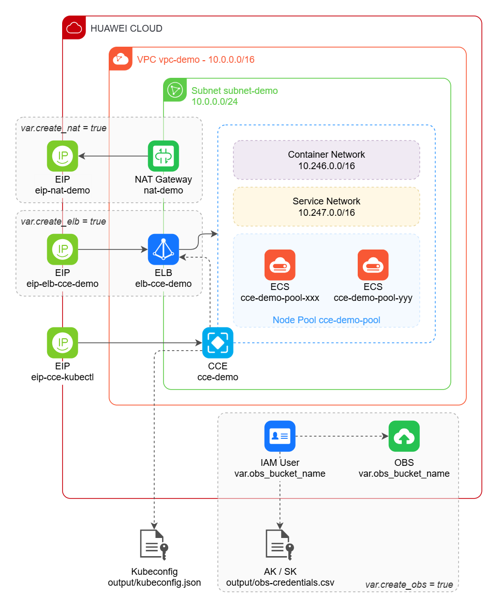

# Huawei Cloud CCE with Terraform

This repository contains Terraform files for a minimal [Huawei Cloud][hwc] CCE
deployment. It includes:

- [Virtual Private Cloud (VPC)][vpc] with one subnet;
- [NAT Gateway][nat] with [Elastic IP (EIP)][eip] + SNAT rule
  for outbound internet access;
- [Cloud Container Engine (CCE)][cce] with one node pool containing two nodes
  ([Elastic Cloud Server (ECS)][ecs]) and EIP for kubectl cluster management;
- [Elastic Load Balance (ELB)][elb] with EIP for inbound access;
- [Object Storage Service (OBS)][obs] bucket + [IAM User][iam] for usage as
  [ReadWriteMany PVC][obs-pvc] in CCE cluster;

The Terraform script also outputs the Kubeconfig file to the `output`
folder, as well as the credentials file for the IAM User with read/write
permissions in the OBS bucket.

## Instructions

1. Install Terraform - <https://developer.hashicorp.com/terraform/downloads>
2. Make a copy of `terraform.tfvars.example` named `terraform.tfvars` and
   set AK, SK and passwords;
3. Run `terraform init` the first time to download provider files;
4. Run `terraform plan` to check what will be done;
5. Run `terraform apply` to provision the infrastructure.

## References

- Huawei Cloud Terraform provider documentation:
  <https://registry.terraform.io/providers/huaweicloud/huaweicloud/latest/docs>
- Huawei Cloud Terraform boilerplate:
  <https://github.com/huaweicloud-latam/terraform-boilerplate>

[hwc]: <https://www.huaweicloud.com/intl/en-us/>
[cce]: <https://www.huaweicloud.com/intl/en-us/product/cce.html>
[vpc]: <https://www.huaweicloud.com/intl/en-us/product/vpc.html>
[nat]: <https://www.huaweicloud.com/intl/en-us/product/nat.html>
[eip]: <https://www.huaweicloud.com/intl/en-us/product/eip.html>
[elb]: <https://www.huaweicloud.com/intl/en-us/product/elb.html>
[ecs]: <https://www.huaweicloud.com/intl/en-us/product/ecs.html>
[obs]: <https://www.huaweicloud.com/intl/en-us/product/obs.html>
[iam]: <https://www.huaweicloud.com/intl/en-us/product/iam.html>
[obs-pvc]: <https://support.huaweicloud.com/intl/en-us/usermanual-cce/cce_10_0378.html>
