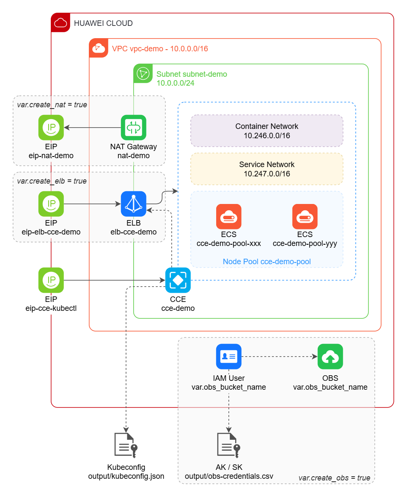
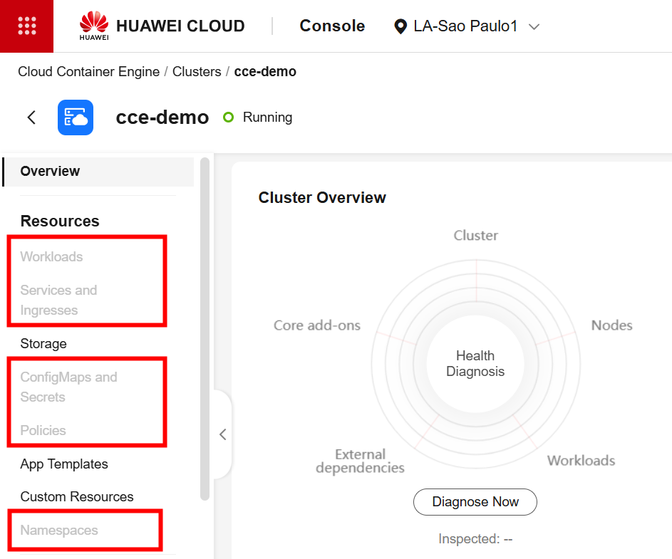

# Huawei Cloud CCE with Terraform

This repository contains Terraform files for a minimal [Huawei Cloud][hwc] CCE
deployment. It includes:

- [Virtual Private Cloud (VPC)][vpc] with one subnet;
- [NAT Gateway][nat] with [Elastic IP (EIP)][eip] + SNAT rule
  for outbound internet access;
- [Cloud Container Engine (CCE)][cce] with one node pool containing two nodes
  ([Elastic Cloud Server (ECS)][ecs]) and EIP for kubectl cluster management;
- [Elastic Load Balance (ELB)][elb] with EIP for inbound access;
- [Object Storage Service (OBS)][obs] bucket + [IAM User][iam] for usage as
  [ReadWriteMany PVC][obs-pvc] in CCE cluster;

The Terraform script also outputs the Kubeconfig file to the `output`
folder, as well as the credentials file for the IAM User with read/write
permissions in the OBS bucket.

## Instructions

1. Install Terraform - <https://developer.hashicorp.com/terraform/downloads>
2. Make a copy of `terraform.tfvars.example` named `terraform.tfvars` and
   set AK, SK and passwords;
3. Run `terraform init` the first time to download provider files;
4. Run `terraform apply -target module.cce` to provision the Huawei Cloud
   infrastructure;
5. Run `terraform apply` to add the permissions in the cluster (explanation
   below).

## Cluster Permissions

When a new cluster is created, only the user that created it is allowed to
operate the cluster. Other users (and agencies), even if they have CCE
permissions granted by IAM policies, will not be able to perform certain
actions inside the cluster. This problem is illustrated in the picture below,
where some menu options are disabled for another user when they access the
cluster:

To solve this issue, the module `k8s` is used to grant permissions inside the
CCE cluster, for the given IAM user names and IAM agency names specified by
variables `cce_authorized_agencies` and `cce_authorized_users`. This module
can only be executed after the cluster is created, and the credentials file
`output/kubeconfig.json` is available.

## References

- Huawei Cloud Terraform provider documentation:
  <https://registry.terraform.io/providers/huaweicloud/huaweicloud/latest/docs>
- Huawei Cloud Terraform boilerplate:
  <https://github.com/huaweicloud-latam/terraform-boilerplate>
- Namespace Permissions (Kubernetes RBAC-based): <https://support.huaweicloud.com/intl/en-us/usermanual-cce/cce_10_0189.html>

[hwc]: <https://www.huaweicloud.com/intl/en-us/>
[cce]: <https://www.huaweicloud.com/intl/en-us/product/cce.html>
[vpc]: <https://www.huaweicloud.com/intl/en-us/product/vpc.html>
[nat]: <https://www.huaweicloud.com/intl/en-us/product/nat.html>
[eip]: <https://www.huaweicloud.com/intl/en-us/product/eip.html>
[elb]: <https://www.huaweicloud.com/intl/en-us/product/elb.html>
[ecs]: <https://www.huaweicloud.com/intl/en-us/product/ecs.html>
[obs]: <https://www.huaweicloud.com/intl/en-us/product/obs.html>
[iam]: <https://www.huaweicloud.com/intl/en-us/product/iam.html>
[obs-pvc]: <https://support.huaweicloud.com/intl/en-us/usermanual-cce/cce_10_0378.html>
